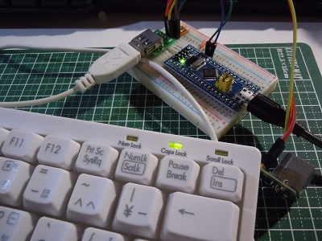
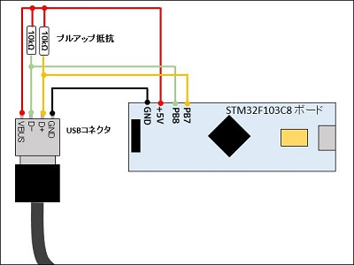
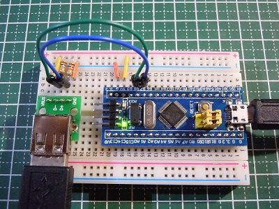
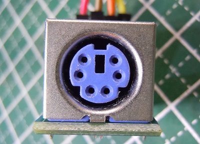
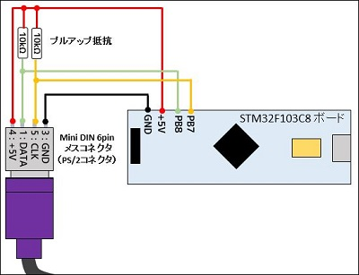
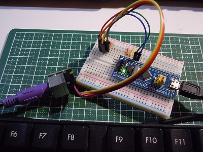

#Arduino STM32用 PS/2 キーボードライブラリ



##概要

本ライブラリはSTM32F103x搭載ボードにてPS/2 キーボードを利用するためのライブラリです。  
Arduino STM32環境にて利用可能可能です。


##ライブラリ名称
TKeyboard(ヘッダファイル TKeyboard.h)

##特徴
- 日本語キーボード、USキーボードに対応しています。
- キーボード上のキーの[押した]、[離した]の情報が取得可能です。
- Shiftキー、Ctrlキー、Altキー、Windowsキーの同時押しの情報が取得可能です。
- キーボードに対して、送信禁止・送信開始の制御が可能です。
- CapsLockキー、NumLockキー、ScrollLockキー用のLEDの点灯・消灯の制御が可能です。

##利用環境
- 開発環境
Arduino IDE 1.6.10以上 + Arduino STM32環境がインストールされていること
- STM32マイコンボード
※M32F103C8T6搭載ボードにて動作確認を行ています。
- PS/2インタフェース対応キーボード (PS2/端子、USB端子接続)

##ライブラリのインストール
- Arduino IDEを起動していない状態で  
フォルダ **TKeyboard** を各自のArduino_STM32インストール先フォルダの  
**Arduino_STM32\\STM32F1\\libraries\\** に配置して下さい。
- 配置後、Arduino IDEを起動して、メニュー [ファイル]-[スケッチの例]をクリックして  
ライブラリ**TKeyboard**が追加されていることを確認して下さい。

##ハードウェア構成
### USBコネクタ接続構成
有線USBキーボードの多くのは、PS/2インタフェースにも対応しています。  
この場合、USB端子のD+はPS/2のCLK、D-はDATAの信号線となります。

####結線図
PB7をCLK、PB8をDATAとして利用する場合の結線を下記に示します。  
CLK、DATAは10kΩの1/4W抵抗にてプルアップします。  


####ブレッドボード上に実装した例


### PS/2コネクタ接続構成
PS/2コネクタはMini DIN 6pinメスコネクタを利用します。  


####結線図
PB7(CLK)をDIN 6pin端子の5番端子、PB8(DATA)を1番ピンに接続します。  
3番ピンはGND、4番ピンは+5Vに結線します。  
また、CLK、DATAは10kΩの1/4W抵抗にてプルアップします。  


####ブレッドボード上に実装した例


##ライブラリリファレンス
ライブラリはクラスライブラリとして実装しています。  

###ヘッダーファイル
`#include <TKeyboard.h>`

###クラス名
`TKeyboard`

###メンバー関数

####利用開始
PS/2キーボードの利用を開始します。  

- 書式
`uint8_t begin(uint8_t clk, uint8_t dat, uint8_t flgLED=false, uint8_t flgUS=false)`

- 引数
**clk**: PS/2 CLOCK接続ピン番号  
**dat**: PS/2 DATA接続ピン番号  
**flgLED**: false LED制御をしない、true LED制御を行う  
**flgUS**: false 日本語キーボード、true USキーボード  

- 戻り値
**0**: 正常終了  
**0以外**: 異常終了  
- 説明
PS/2キーボード利用を開始します。  
キーボードに対して初期化を行い、キー入力検出のための割り込みを有効にします。  
キーボードからの入力情報を取得するためには、本関数を事前に実行す必要があります。  

####利用終了
PS/2キーボードの利用を終了します。  

- 書式
`vcid end()`

- 引数
なし

- 戻り値
なし

- 説明
PS/2キーボードの利用を終了します。  
キーボード入力のための割り込みは登録を削除します。  

###キーボード初期化
接続しているキーボードの初期化を行います。  

- 書式
`uint8_t init()`

- 引数
なし

- 戻り値
**0**: 正常終了
**0以外**: 異常終了

- 説明
接続しているキーボードのチェックを行い、PS/2キーボードの初期化を行います。  
CapsLock等の状態及び、入力バッファは初期化されます。  
本関数は利用開始時(begin関数実行）にも呼び出されます。  
利用開始後、本関数によりいつでもキーボードの初期化を行うことが出来ます。  
キーボードの認識が行えない場合はエラーを返します。  

###キーボード入力割り込み許可
PS/2キーボード入力の割り込みの実行を許可します。  

- 書式
`void enableInterrupts()`

- 引数
なし

- 戻り値
なし

- 説明
禁止したPS/2キーボード入力の割り込みの実行を許可します。  

###キーボード入力割り込み禁止
PS/2キーボード入力の割り込みの実行を禁止します。  

- 書式
`void disableInterrupts()`

- 引数
なし

- 戻り値
なし

- 説明
禁止したPS/2キーボード入力の割り込みの実行を禁止します。  
割り込み禁止中は、キーボードからの入力情報の取得を行うことが出来ません。  

###PS/2 アイドル設定
キーボードとの通信をアイドル状態にし、データ受信可能状態にします。  

- 書式
`void mode_idole()`

- 引数
なし

- 戻り値
なし

- 説明
PS/2通信方向をキーボード=>ホストの方向に設定し、データ受信が可能な状態にします。  

###PS/2 通信禁止設定
キーボードからのデータ送信を禁止状態にします。  

- 書式
`void mode_stop()`

- 引数
なし

- 戻り値
なし

- 説明
キーボードからのデータ送信を禁止します。  
禁止している間の入力情報はキーボードのバッファに蓄えられ、  
通信可能状態になった時点で送信されます。  
禁止することにより、キーボードからの送信がなくなり、  
入力のための割り込みの実行も発生しなくなります。  
本関数は割り込みを一時的に実行したくない場合に利用します。  
禁止後は、mode_idole()にて通信可能状態に戻す必要があります。    

###PS/2 ホスト送信モード設定
PS/2の通信をホスト送信モードに設定します。  

- 書式
`void mode_send()`

- 引数
なし

- 戻り値
なし

- 説明
PS/2通信方向をホスト=>キーボードの方向に設定し、  
ホストからのデータ送信が可能な状態にします。  
(注意)現行バージョンでは、ホストからのキーボードへのデータ送信機能利用出来ません。  

###キーボード入力情報の取得
キーボードからキー入力情報を取得します。  

- 書式
`keyEvent read() )`

- 引数
なし

- 戻り値
キー入力イベント情報

- 説明
キーボードからキー入力情報を1件取得します。  
取得した入力情報(キー入力イベント情報)は、次のデータ構造となります。  

キーボードイベント構造体  
キーボードから取得したデータは次のKeyEvent型となります。  
```
typedef struct  {
    uint8_t code  : 8; // code
    uint8_t BREAK : 1; // BREAKコード
    uint8_t KEY   : 1; // KEYコード判定
    uint8_t SHIFT : 1; // SHIFTあり
    uint8_t CTRL  : 1; // CTRLあり
    uint8_t ALT   : 1; // ALTあり
    uint8_t GUI   : 1; // GUIあり
    uint8_t dumy  : 2; // ダミー
} keyEvent;
```
構造体メンバの詳細

- code
アスキーコード または キーコード が格納されます。  
0の場合は入力無し、255の場合はエラーとなります。  
本関数で入力情報を取得後は、**code**の内容をチェックし**入力無し**を判定する必要があります。  
アスキーコード化出来ないキー入力は通常、キーコードが格納されます。  
キーコードは他のシステムとは互換性の無い、本ライブラリ固有のコード体系です。  
キーコードはヘッダーファイル内にて定義されています。  
定義内容については、**「定義一覧」**の節を参照して下さい。  

- BREAK
キーの押し離し状態がセットされます。  
0: 押した、1:離した  

- KEY
codeに格納された状態がアスキーコード か キーコードか識別する情報です。  
0: アスキーコード、1:キーコード  

- SHIFT
SHIFTキーが押されている状況がセットされます。  
0:押していない 、 1:押している  

- CTRL
CTRLキーが押されている状況がセットされます。  
0:押していない 、 1:押している  

- ALT
ALTキーが押されている状況がセットされます。  
0:押していない 、 1:押している  

- GUI
Windowsキーが押されている状況がセットされます。  
0:押していない 、 1:押している  

- dumy
未使用です  

**仕様および制約等**
- キーボード上のキーを押して、離した場合入力情報として２件のデータが発生します。  
 1)押した時: **BREAK**に0がセットされた入力情報  
 2)離した時: **BREAK**に1がセットされた入力情報  

- キーボードを押しっぱなしにした場合は、
キーボードのリピート機能により、押している間、入力情報が複数は発生します。  
この入力情報は**BREAK**に0がセットされた状態となり、離した時点で  
**BREAK**に1がセットされた情報となります。  

- 次の入力制御を行うキーについては、入力情報は発生しません。
 - SHIFTキー
 - Ctrlキー
 - Altキー
 - Windowsキー
 - CapsLockキー
 - NumLockキー
 - ScrollLockキー

###定数一覧

キーコードの定義

(1)制御キー・特殊キーのキーコード  

| 定義名 | 値 |意味|
|----------|------------|-----------------------|
|KEY_ERROR|        0xFF |キーコードエラー
|KEY_NONE |           0 | 入力なし
| KEY_L_Alt|          1	| [左Alt]
| KEY_L_Shift|		  2	| [左Shift]
| KEY_L_Ctrl|		  3	| [左Ctrl]
| KEY_R_Shift|		  4	| [右Shift]
| KEY_R_Alt|		  5	| [右Alt]
| KEY_R_Ctrl|		  6	| [右Ctrl]
| KEY_L_GUI|		  7	| [左Windowsキー]
| KEY_R_GUI|		  8	| [右Windowsキー]
| KEY_NumLock|		  9	| [NumLock]
| KEY_ScrollLock|	 10	| [ScrollLock]
| KEY_CapsLock|	     11	| [CapsLock]
| KEY_PrintScreen|	 12	| [PrintScreen]
| KEY_HanZen|		 13	| [半角/全角 漢字]
| KEY_Insert|		 14	| [Insert]
| KEY_Home|		     15	| [Home]
| KEY_Pause|		 16	| [Pause]
| KEY_Romaji|		 17	| [カタカナ ひらがな ローマ字]
| KEY_APP|			 18	| [メニューキー]
| KEY_Henkan|		 19	| [変換]
| KEY_Muhenkan|	     20	| [無変換]
| KEY_PageUp|		 21	| [PageUp]
| KEY_PageDown|	     22	| [PageDown]
| KEY_End|			 23	| [End]
| KEY_L_Arrow|		 24	| [←]
| KEY_Up_Arrow|	     25	| [↑]
| KEY_R_Arrow|		 26	| [→]
| KEY_Down_Arrow|	 27	| [↓]
| KEY_ESC|			 30	| [ESC]
| KEY_Tab| 		     31	| [Tab]
| KEY_Space|		 32	| [空白]
| KEY_Backspace|	 33	| [BackSpace]
| KEY_Delete|		 34	| [Delete]
| KEY_Enter|		 35	| [Enter]

(2)通常キー（ASCIIコード変換可能キー)のキーコード  

| 定義名 | 値 |意味|
|--------|----------|------|
| KEY_Colon      |36| [: *]
| KEY_Semicolon  |37| [; +]
| KEY_Kamma      |38| [, <]
| KEY_minus      |39| [- =]
| KEY_Dot        |40| [. >]
| KEY_Question   |41| [/ ?]
| KEY_AT         |42| [@ \`]
| KEY_L_brackets |43| [[ {]
| KEY_Pipe       |44| [\｜]
| KEY_R_brackets |45| [] }]
| KEY_Hat        |46| [^ ~]
| KEY_Ro         |47| [\ _ ろ]
| KEY_0          |48| [0 )]
| KEY_1		     |49| [1 !]
| KEY_2			 |50| [2 @]
| KEY_3			 |51| [3 #]
| KEY_4			 |52| [4 $]
| KEY_5			 |53| [5 %]
| KEY_6			 |54| [6 ^]
| KEY_7			 |55| [7 &]
| KEY_8			 |56| [8 *]
| KEY_9			 |57| [9 (]
| KEY_Pipe2      |58| [\｜] (USキーボード用)
| KEY_A			 |65| [a A]
| KEY_B			 |66| [b B]
| KEY_C			 |67| [c C]
| KEY_D			 |68| [d D]
| KEY_E			 |69| [e E]
| KEY_F			 |70| [f F]
| KEY_G			 |71| [g G]
| KEY_H			 |72| [h H]
| KEY_I			 |73| [i I]
| KEY_J			 |74| [j J]
| KEY_K			 |75| [k K]
| KEY_L			 |76| [l L]
| KEY_M			 |77| [m M]
| KEY_N			 |78| [n N]
| KEY_O			 |79| [o O]
| KEY_P			 |80| [p P]
| KEY_Q			 |81| [q Q]
| KEY_R			 |82| [r R]
| KEY_S			 |83| [s S]
| KEY_T			 |84| [t T]
| KEY_U			 |85| [u U]
| KEY_V			 |86| [v V]
| KEY_W			 |87| [w W]
| KEY_X			 |88| [x X]
| KEY_Y			 |89| [y Y]
| KEY_Z			 |90| [z Z]


(3)テンキーのキーコード

| 定義名 | 値 |意味|
|--------|----------|------|
| KEY_PAD_Equal |94	| [=]
| KEY_PAD_Enter	|95	| [Enter]
| KEY_PAD_0		|96 | [0/Insert]
| KEY_PAD_1		|97 | [1/End]
| KEY_PAD_2		|98 | [2/DownArrow]
| KEY_PAD_3		|99 | [3/PageDown]
| KEY_PAD_4		|100| [4/LeftArrow]
| KEY_PAD_5		|101| [5]
| KEY_PAD_6		|102| [6/RightArrow]
| KEY_PAD_7		|103| [7/Home]
| KEY_PAD_8		|104| [8/UPArrow]
| KEY_PAD_9		|105| [9/PageUp]
| KEY_PAD_Multi	|106| [*]
| KEY_PAD_Plus	|107| [+]
| KEY_PAD_Kamma	|108| [,]
| KEY_PAD_Minus	|109| [-]
| KEY_PAD_DOT	|110| [./Delete]
| KEY_PAD_Slash	|111| [/]

(4)ファンクションキーのキーコード

| 定義名 | 値 |意味|
|----------|--------|------|
| KEY_F1 	|112	| [F1]
| KEY_F2 	|113	| [F2]
| KEY_F3 	|114	| [F3]
| KEY_F4 	|115	| [F4]
| KEY_F5 	|116	| [F5]
| KEY_F6 	|117	| [F6]
| KEY_F7 	|118	| [F7]
| KEY_F8 	|119	| [F8]
| KEY_F9 	|120	| [F9]
| KEY_F10 	|121	| [F10]
| KEY_F11 	|122	| [F11]
| KEY_F12 	|123	| [F12]
| KEY_F13 	|124	| [F13]
| KEY_F14 	|125	| [F14]
| KEY_F15 	|126	| [F15]
| KEY_F16 	|127	| [F16]
| KEY_F17 	|128	| [F17]
| KEY_F18 	|129	| [F18]
| KEY_F19 	|130	| [F19]
| KEY_F20 	|131	| [F20]
| KEY_F21 	|132	| [F21]
| KEY_F22 	|133	| [F22]
| KEY_F23 	|134	| [F23]

(5)マルチマディアキーのキーコード

| 定義名 | 値 |意味|
|-------------------|---|---------------|
| KEY_PrevTrack		|135| 前のトラック
| KEY_WWW_Favorites	|136| ブラウザお気に入り
| LEY_WWW_Refresh	|137| ブラウザ更新表示
| KEY_VolumeDown	|138| 音量を下げる
| KEY_Mute			|139| ミュート
| KEY_WWW_Stop		|140| ブラウザ停止
| KEY_Calc			|141| 電卓
| KEY_WWW_Forward	|142| ブラウザ進む
| KEY_VolumeUp		|143| 音量を上げる
| KEY_PLAY			|144| 再生
| KEY_POWER			|145| 電源ON
| KEY_WWW_Back		|146| ブラウザ戻る
| KEY_WWW_Home		|147| ブラウザホーム
| KEY_Sleep			|148| スリープ
| KEY_Mycomputer	|149| マイコンピュータ
| KEY_Mail			|150| メーラー起動
| KEY_NextTrack		|151| 次のトラック
| KEY_MEdiaSelect	|152| メディア選択
| KEY_Wake			|153| ウェイクアップ
| KEY_Stop			|154| 停止
| KEY_WWW_Search	|155| ウェブ検索

##サンプルスケッチ
TKeyboard_exsample.ino
```
#include <TKeyboard.h>

// [PS/2接続利用ピンの定義]
//   DIN6Pコネクタ
//  5 @ U @ 6   1:Data => DataPin
// 3 @     @ 4  2:NC
//    @   @     3:GND  => GND
//    1   2     4:5V   => 5V
//              5:CLK  => IRQpin
//              6:NC
//
//  USBコネクタ利用時(注意 PS/2対応キーボードのみ)
//  1: VBUS => 5V
//  2: D-   => DataPin
//  3: D+   => IRQpin
//  4: GND  => GND

const int IRQpin =  PB7;  // CLK(D+)
const int DataPin = PB8;  // Data(D-)

// PS/2 Keyboard object
TKeyboard kb;

void setup() {

  // USBシリアル通信の初期設定
  // ※USB経由のシリアル通信を使わない場合は、要修正
  Serial.begin(115200);
  while (!Serial.isConnected()) delay(100);

  Serial.println("Keyboard Test(v1.0):");

  // PS/2 キーボードの利用開始
  // begin()の引数： CLKピンNo、DATAピンNo、LED制御あり/なし、USキーボードを利用する/しない
  if ( kb.begin(IRQpin, DataPin, true, true) ) {
    // 初期化に失敗時はエラーメッセージ表示
    Serial.println("PS/2 Keyboard initialize error.");
  }
}

void loop() {
  uint8_t  c;
  keyEvent k; // キー入力情報

  // キー入力情報(キーイベント構造体のメンバーは下記の通り)
  // k.code  : アスキーコード or キーコード(TKeyboard.hna内の#define参照)
  //            0の場合は入力無し、255の場合はエラー
  // k.BREAK : キー押し情報                  => 0: 押した、1:離した
  // k.KEY   : キーコード/アスキーコード種別 => 0: アスキーコード、1:キーコード
  // k.SHIFT : SHIFTキー押し判定             => 0: 押していない 、 1:押している
  // k.CTRL  : CTRLキー押し判定              => 0: 押していない 、 1:押している
  // k.ALT   : ALTキー押し判定               => 0: 押していない 、 1:押している
  // k.GUI   : GUI(Windowsキー)押し判定     = > 0: 押していない 、 1:押している

  if (Serial.available()) {
    // 動作確認 コマンド
    //  i: PS/2 キーボードの初期化
    //  l: CapsLock、NumLock、ScrolLock用LEDの点灯
    //  m: CapsLock、NumLock、ScrolLock用LEDの消灯

    // シリアルからの入力コマンドチェック
    c = Serial.read();
    if (c == 'i') {
      // キーボードの初期化(この処理はbegin()後、いつでも呼び出して初期化可能)
      kb.init();
    } else if (c == 'l') {
      // LEDの点灯 (引数：led_caps,led_num, led_scrol)
      kb.ctrl_LED(1,1,1);
    } else if (c == 'm') {
      // LEDの消灯 (引数：led_caps,led_num, led_scrol)
      kb.ctrl_LED(0,0,0);
    }
  }

  // キーボードからの入力情報取得
  k = kb.read();
  if (k.code) {  // ※入力無しの場合は0、0以外の時に入力値の評価を行う
    if (k.BREAK)
      Serial.print("[Break]"); // キーを離した
    if (k.KEY)
      Serial.print("[KEY]");   // codeの内容はキーコードである
    if (k.SHIFT)
      Serial.print("[Shift]"); // シフトキーが同時に押されている
    if (k.CTRL)
      Serial.print("[Ctrl]");  // Ctrlキーが同時に押されている
    if (k.ALT)
      Serial.print("[Alt]");   // Altキーが同時に押されている
    if (k.GUI)
      Serial.print("[Win]");   // Windowsキーが同時に押されている

    if (k.KEY) {
      // 入力キーがASCIIコード化出来ない場合は、キーコードを表示する
      Serial.print("key_code=");
      Serial.println(k.code);
    } else {
      // アスキーコードの場合は、その文字を表示する
      Serial.print("ascii:");
      Serial.write(k.code);
      Serial.println();
    }
  }
}
```
